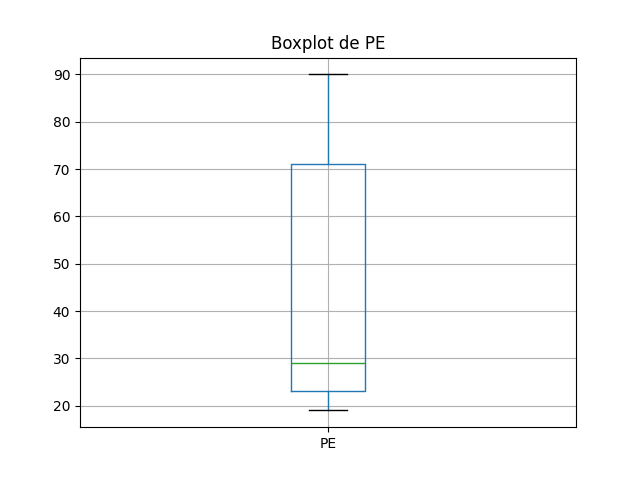
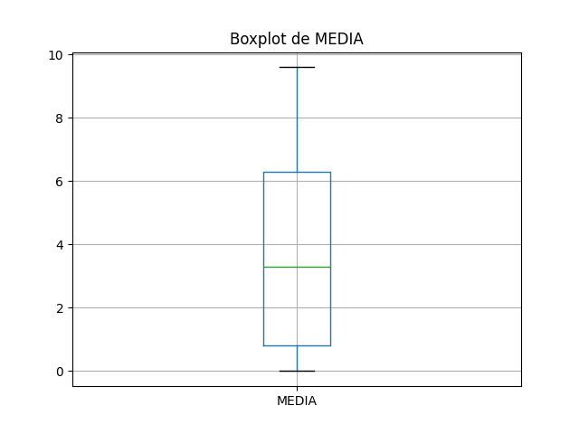

# Resultados da Análise

## Coeficientes de Correlação

### Spearman
- Coeficiente de Spearman: 0.38
- Valor-p: 0.01

### Pearson
- Coeficiente de Pearson: 0.56
- Valor-p: 0.00

## Gráficos

### Gráfico de Dispersão

    
    
Gráfico de Dispersão

### Boxplot de PE (Porcentagem de Frequência na Extensão)

    
    
Boxplot de PE (Porcentagem de Frequência na Extensão)

### Boxplot de MEDIA

    
    
Boxplot de MEDIA

