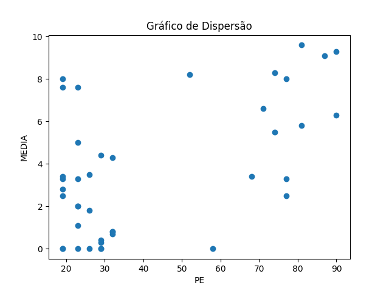
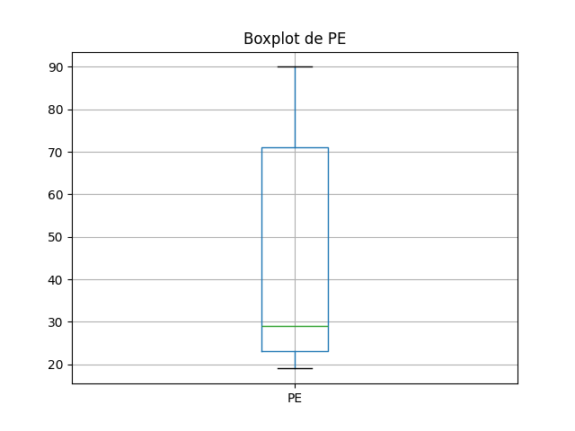
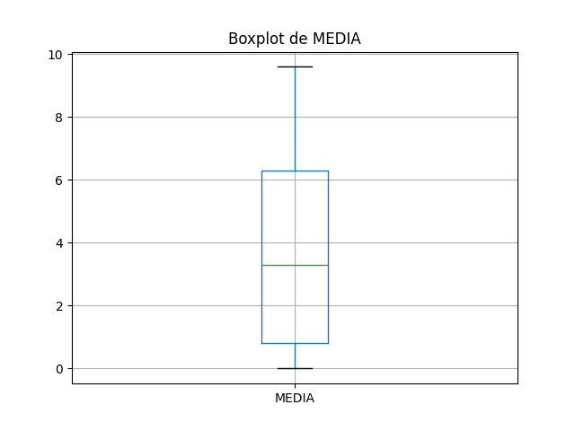

# Resultados de Análise
## Coeficientes de Correlação
### Spearman
- Coeficiente de Spearman: 0.3872721678494852
- Valor-p: 0.012365551004089889
### Pearson
- Coeficiente de Pearson: 0.5612322800383469
- Valor-p: 0.00013489699376471062

## Gráficos
### Gráfico de Dispersão

### Boxplot de PE

### Boxplot de MEDIA

