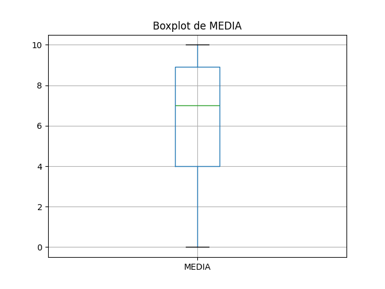

# Resultados de Análise
## Coeficientes de Correlação

### Spearman
- Coeficiente de Spearman: 0.36082156160333273
- Valor-p: 0.02047002639571891
- 
### Pearson
- Coeficiente de Pearson: 0.36059175725285936
- Valor-p: 0.020556352854879674

## Gráficos

### Gráfico de Dispersão

### Boxplot de PE

### Boxplot de MEDIA

