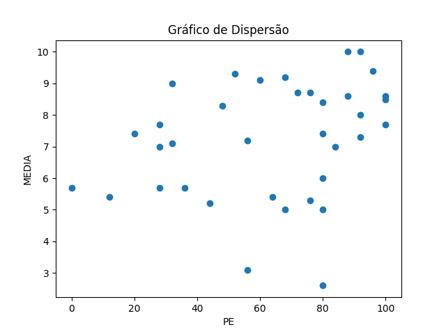
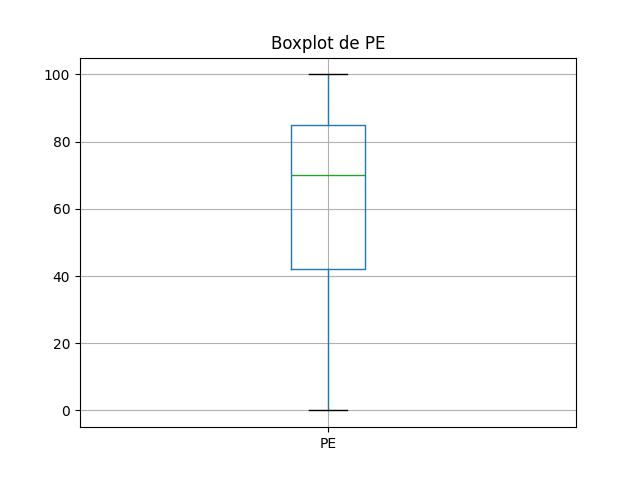
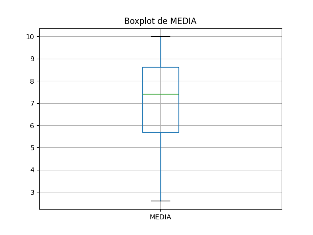

# Resultados de Análise

## Coeficientes de Correlação

### Spearman
- Coeficiente de Spearman: 0.34
- Valor-p: 0.04

### Pearson
- Coeficiente de Pearson: 0.29
- Valor-p: 0.09

## Gráficos

### Gráfico de Dispersão

### Boxplot de PE

### Boxplot de MEDIA

