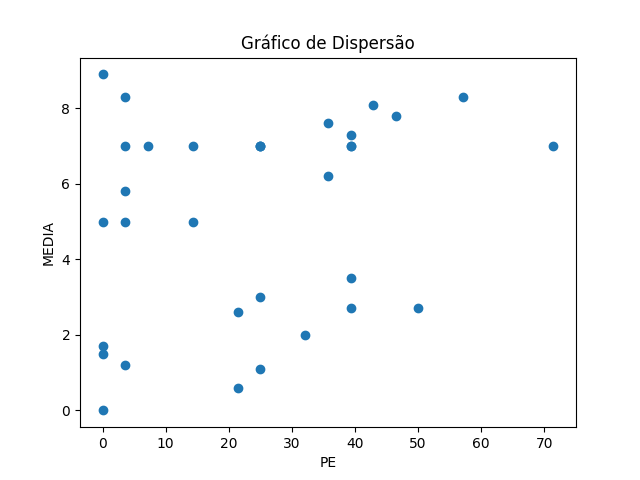
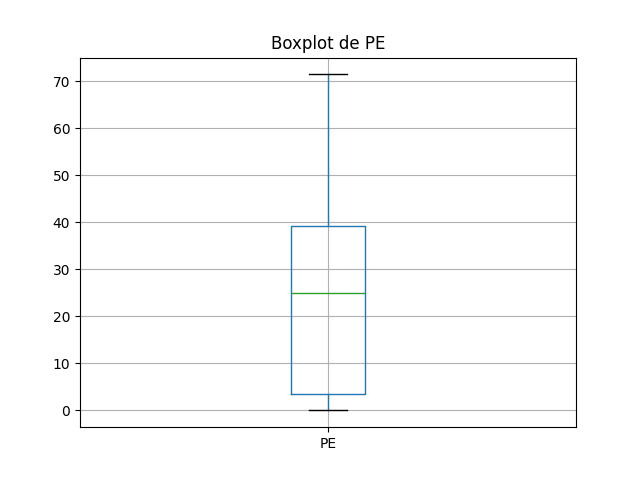
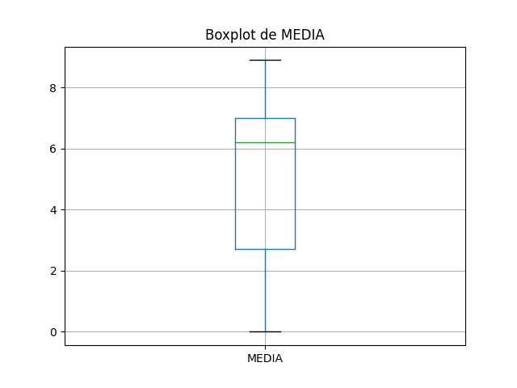

# Resultados de Análise

## Coeficientes de Correlação

### Spearman
- Coeficiente de Spearman: 0.32
- Valor-p: 0.07

### Pearson
- Coeficiente de Pearson: 0.26
- Valor-p: 0.15

## Gráficos
### Gráfico de Dispersão

### Boxplot de PE

### Boxplot de MEDIA

