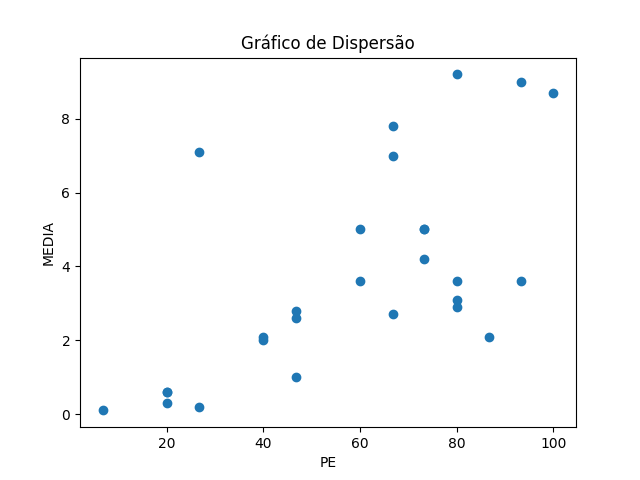
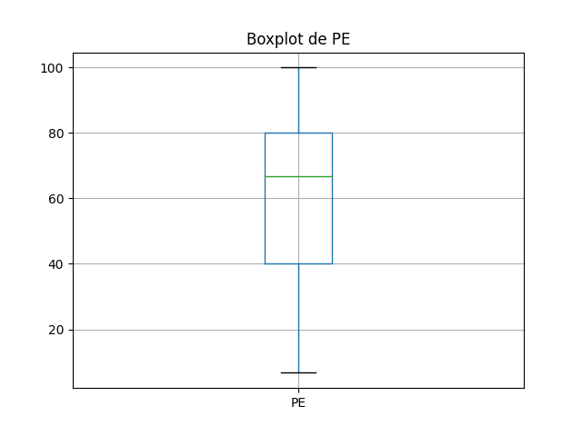
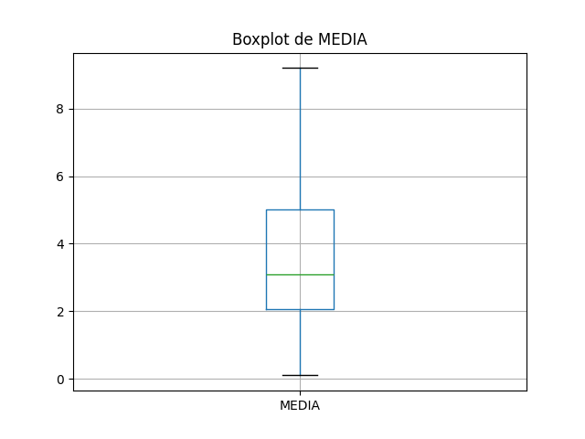

# Resultados de Análise
## Coeficientes de Correlação

### Spearman
- Coeficiente de Spearman: 0.67
- Valor-p: 0.0001

### Pearson
- Coeficiente de Pearson: 0.63
- Valor-p: 0.0004

## Gráficos
### Gráfico de Dispersão

### Boxplot de PE

### Boxplot de MEDIA

