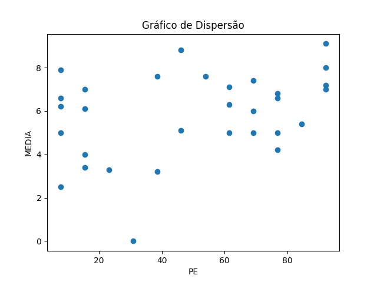
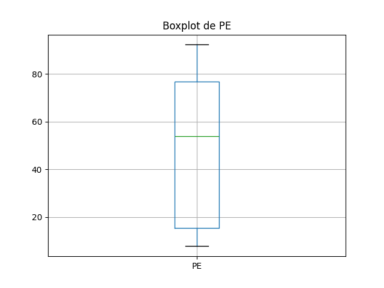
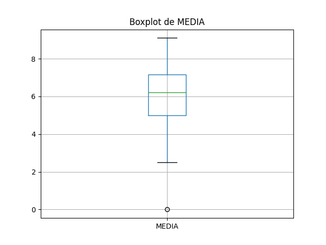

# Resultados de Análise
## Coeficientes de Correlação
### Spearman
- Coeficiente de Spearman: 0.3311706251998507
- Valor-p: 0.06878215540009514
### Pearson
- Coeficiente de Pearson: 0.3594632907056332
- Valor-p: 0.0470211688039267

## Gráficos
### Gráfico de Dispersão

### Boxplot de PE

### Boxplot de MEDIA

