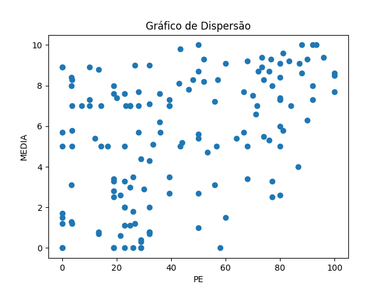
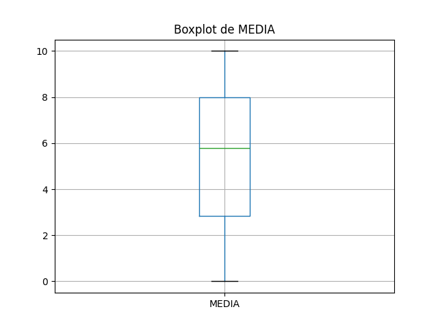

# Resultados de Análise

## Coeficientes de Correlação

### Spearman
- Coeficiente de Spearman: 0.41
- Valor-p: 1.35

### Pearson
- Coeficiente de Pearson: 0.42
- Valor-p: 6.58

## Gráficos

### Gráfico de Dispersão

### Boxplot de PE

### Boxplot de MEDIA

