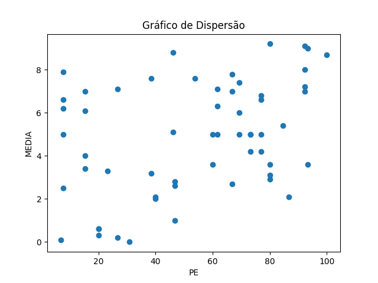
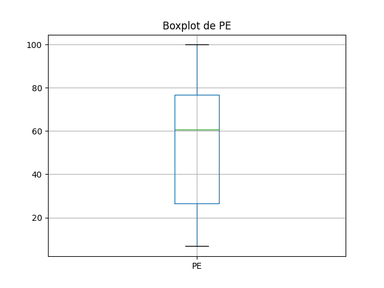
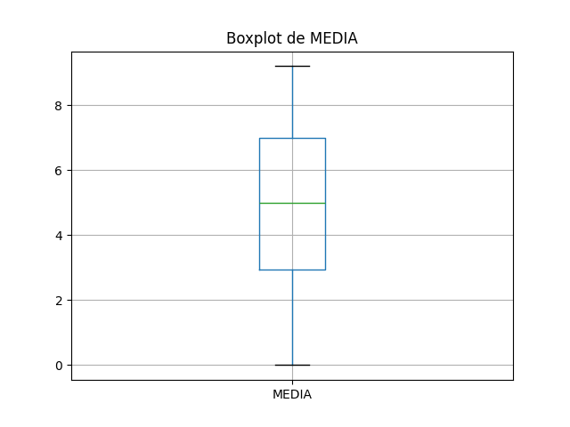

# Resultados de Análise
## Coeficientes de Correlação
### Spearman
- Coeficiente de Spearman: 0.35
- Valor-p: 0.00

### Pearson
- Coeficiente de Pearson: 0.38
- Valor-p: 0.00

## Gráficos

### Gráfico de Dispersão

### Boxplot de PE

### Boxplot de MEDIA

